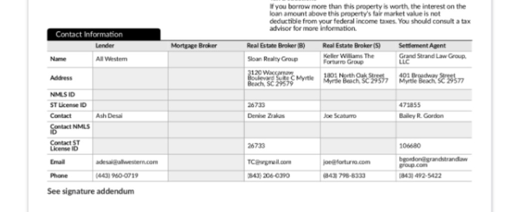
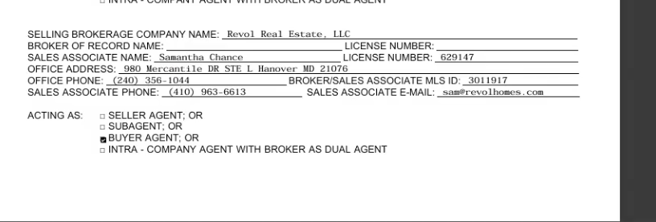
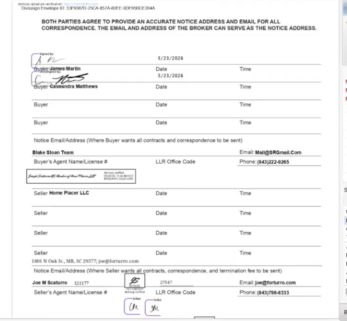

# Video 4 Gaps — `processor-assistant-review`

**Source:** `notes.txt` lines 571–636 (File 4 — Cassandra Matthews & James, loan `2605968646`)
**Repo:** `/Users/naomi/Desktop/FINTOR/processor-assistant-review`
**Scope searched:** `definitions/`, `output/tools/`, `shared/`, `output/config/`, sibling `processor-assistant-communications`

**Legend:** ✅ IMPLEMENTED · 🟡 PARTIAL · ❌ NOT IMPLEMENTED · 🔒 FACTORY-LOCK

This video introduced three **document → File Contacts write** gaps (cover-letter image, ESS,
purchase contract), a **vesting write** refinement, an **action-item** decision (remove the HOA
Blend follow-up), and a **bank-statement** verification question. Each is documented below with
current state, evidence, and an implementation plan.

---

## Status matrix

### Gap A — Cover Letter image → File Contacts (`notes.txt:576-579`)

> "Write from image into file Contacts. Deleted file contacts from the cover letter so likely just
> needs to populate it in file contacts. Deleted team contacts."

| Item | Status | Evidence |
|---|---|---|
| OCR the image Almas sends (`additional_info.almas_notes_images`) | ✅ | `extract_almas_images` (substep 0.6), `data_gathering.py:2119-2250`. Claude-vision prompt explicitly asks for a `KEY CONTACTS` section; result stored on `state["almas_notes_images"]`. |
| Image text → Cover Letter (`CX.KM.SUBMISSION.NOTES`) | ✅ | `draft_cover_letter.py:106-142,183-186` appends OCR text to submission notes. |
| Strip team contacts from cover letter | ✅ | `draft_cover_letter.py:31-44` (`_strip_boilerplate` drops `team contacts` lines). |
| Image contacts → **File Contacts** (Encompass) | ✅ **(implemented)** | `review_file_contacts.py` parses the OCR'd `KEY CONTACTS` block (`_parse_image_contacts`) and **syncs** Escrow Company / Buyer's Agent / Seller's Agent file contacts via the new `write_loan_contacts()` helper (`PATCH /v3/loans/{id}/contacts`, list body — verified live): missing contacts are **created**, and a present contact that **differs from the image is overwritten** (`_sync_contacts_from_image`). OCR fields that look incomplete/invalid (truncated email/phone) are **skipped** — and since the PATCH merges by `contactType`, a skipped field keeps its existing Encompass value. Every create/overwrite emits an `info-overwrite` flag (the overwrite flag lists the field-by-field diff). Verified end-to-end on Test loan `3a9c1320` and against the File-4 OCR. |

### Gap B — Estimated Settlement Statement (ESS) → File Contacts (`notes.txt:581-592`)

> Settlement Agent column → Escrow (Title) Company: ST License ID → Company License #,
> Contact ST License ID → Contact License #, File # → Escrow Case #, check addresses match.
> Real Estate Broker (B) column → Buyer's Agent (same license-# logic); cross-check Purchase
> Agreement Seller's Agent against file contacts' names.

| Item | Status | Evidence |
|---|---|---|
| ESS document present + extracted on File-4 | ✅ | **Correction:** the ESS *does* exist in the live eFolder (1 attachment) and extracts. The earlier cached thread showed `not_found` only because the ESS post-dated that run. Live `GET /v1/loans/{id}/documents` lists `Estimated Settlement Statement`; fresh extraction returns the **65-field fee schema** (shared with Loan Estimate). |
| ESS extraction of the **Contact Information table** (2nd-to-last page) | ❌ | The live 65-field schema has single `Settlement Agent` + `Title Company` fields (both returned **null** on File-4) and **no broker/license fields at all**. It does **not** parse the structured *Contact Information* table (Lender / Mortgage Broker / Real Estate Broker (B) / Real Estate Broker (S) / Settlement Agent columns × Name/Address/NMLS/ST License/Contact/Contact ST License/Email/Phone rows). This table is the source the processor wants — see mapping below. **Server-side schema change required** (CatchingDoc, `LG-docsOrch/devTool/catchingDoc`). |
| ESS Settlement Agent col → **Escrow Company** file contact (Company License #, Contact License #, Escrow Case #) | 🟡 **(write path ready)** | The write primitive (`write_loan_contacts`, Gap A) + the `review_file_contacts` sync path are ready; blocked only on the ESS table reaching `doc_fields`. Mapping confirmed below. |
| ESS Real Estate Broker (B) col → **Buyer's Agent** file contact | 🟡 **(write path ready)** | Same — mapping confirmed below. |
| ESS Real Estate Broker (S) col → **Seller's Agent** file contact | 🟡 **(write path ready)** | Confirmed the ESS table also carries the **Seller's** broker (RE Broker (S)), so the ESS can populate all three agent/escrow contacts. |
| Address match check (ESS vs LOS) | ❌ | Not implemented (becomes a `warning` flag once the table is extracted). |
| Title Report already extracts `settlement_agent` / `escrow_company` / `title_company` | 🟡 | `document_type_registry.py:167-175` normalize these into `state["doc_fields"]` — a useful **fallback** source for the Escrow Company write if the ESS table is absent. |

#### ESS "Contact Information" table → File Contacts mapping (confirmed from File-4 ESS, page N-1)



The ESS's penultimate page carries a structured 5-column contact table. Confirmed values + mapping
(loan `2605968646`):

| ESS column | → File Contact (`contactType`) | Name→`name` | Contact→`contactName` | ST License ID→`bizLicenseNumber` | Contact ST License ID→`personalLicenseNumber` | Email/Phone/Address |
|---|---|---|---|---|---|---|
| **Settlement Agent** | `ESCROW_COMPANY` | Grand Strand Law Group, LLC | Bailey R. Gordon | 471855 | 106680 | bgordon@grandstrandlawgroup.com / (843) 492-5422 / 401 Broadway Street, Myrtle Beach, SC 29577 |
| **Real Estate Broker (B)** | `BUYERS_AGENT` | Sloan Realty Group | Denise Zrakas | 26733 | 26733 | TC@srgmail.com / (843) 206-0390 / 3120 Waccamaw Blvd Ste C, Myrtle Beach, SC 29579 |
| **Real Estate Broker (S)** | `SELLERS_AGENT` | Keller Williams The Forturro Group | Joe Scaturro | — | — | joe@forturro.com / (843) 798-8333 / 1801 North Oak Street, Myrtle Beach, SC 29577 |
| Lender | (skip — already a loan contact) | All Western | Ash Desai | — | — | adesai@allwestern.com / (443) 960-0719 |
| Mortgage Broker | (empty on this file) | — | — | — | — | — |

> Per `notes.txt:583-592`: ST License ID → **Company** License #, Contact ST License ID → **Contact**
> License #, File # → Escrow Case # (`referenceNumber`), and "check if addresses match". The ESS table
> is **richer than the cover-letter image** (Gap A) — it has the license IDs and a full address — so
> when present it should be the **preferred source** over the image OCR.

#### ✅ VALIDATED end-to-end via local-extraction workaround (2026-06-25)

The "Estimated Settlement Statement" bucket on `2605968646` actually holds a **Closing Disclosure**
("pre-CD"). It falls through a gap between two schemas:

| | **ESS** doc type | **CD** doc type |
|---|---|---|
| Has page-5 `contact_*` table? | ✅ 43 fields | ❌ only `settlement_agent_name` |
| Binds this attachment via catchingDoc? | ❌ `not_found` — LLM won't classify CD content as an ESS | ❌ `not_found` — finder `avoid_keywords` skip the ESS bucket |

`selectionMode="All"` and `useLlm=False` do **not** help — the finder never binds the attachment.

**The workaround works** (`scripts/probe_ess_local_extract.py`): download the attachment bytes directly
(`LG-docsOrch/devTool/extract_local.py:download_attachment` → Encompass `attachmentDownloadUrl`; the
`export-attachments` job `POST /efolder/v1/exportjobs` is the robust fallback for cloud/SkyDrive files)
and send the PDF straight to **LandingAI with the full ESS schema** — bypassing the finder entirely.
This returned the complete page-5 table, matching the screenshot exactly (settlement agent + both RE
brokers + lender, with license IDs, addresses, phones, emails).

> ⚠ **Schema-alias bug to fix before productionizing:** `extract_local.py` maps the bucket → doc type
> `"ESS"`, but `/efolder/schemas/ESS` returns a **stale 9-field schema** (no contacts). The
> contact-rich schema (80 props, 43 `contact_*`) is stored under DocumentType
> **"Estimated Settlement Statement"**. The workaround must fetch the schema by that key (or the alias
> must be repointed), otherwise it silently extracts 9 fields and drops the entire contact table.

#### ✅ IMPLEMENTED (2026-06-25)

Gap B is now wired end-to-end. Two halves:

**1. Extraction — download-bypass path** (`shared/ess_contact_bypass.py`).
`extract_ess_contacts(loan_id, state)` lists the eFolder, finds the attachment in the
"Estimated Settlement Statement" bucket, downloads the PDF bytes directly from Encompass
(`attachmentDownloadUrl`), and sends it to **LandingAI with the contacts-only ESS schema**,
bypassing the catchingDoc finder entirely (which won't bind a CD-format pre-CD). It returns the
`contact_*` field map. Best-effort: if `LANDINGAI_API_KEY` is unset or any step fails it returns
`None` and the image-OCR path still runs. **`LANDINGAI_API_KEY` must be set in the deployment env.**

The schema is fetched by the correct DocumentType key — **"Estimated Settlement Statement"**, never
the stale `"ESS"` alias — and bundled at `output/config/ess_contacts_schema.json` as a fallback.

> ⚠ **Root cause of the "docs-orch works but this errors" discrepancy — FIXED.** LandingAI validates
> its *own* extracted output against the schema you send. Empty Contact-Information columns (e.g. the
> Mortgage Broker column, blank on this file) come back as `null`, but the source schema declares
> `"type": "string"` (non-nullable). That mismatch raises a `ValidationError` and LandingAI **discards
> the entire result** (`HTTP 206`, empty `extracted_schema`). The docs-orch probe only appeared to
> work because its full 64-field run happened to return non-null values for those columns — flaky and
> schema-dependent. **Fix:** `_make_nullable()` coerces every property type to `[type, "null"]` so
> empty columns pass validation. Verified on `2605968646`: contacts-only now returns **22 non-empty
> contact fields** (HTTP 200), matching the screenshot.

**2. Client-side write** (`output/tools/review_file_contacts.py`, substep 1.2).
`contact_*` keys were added to the ESS `fields_extracted` in `output/config/required_docs.json` so
`_normalize_efolder_output` lifts them into `state["doc_fields"]` whenever catchingDoc *does* extract a
real ESS. `_parse_doc_contacts(state, loan_id)` reads those first and falls back to the bypass for
pre-CD loans. The renamed `_sync_contacts()` merges the settlement statement **per field over** the
cover-letter image (ESS wins — it carries license #s + full address), then creates/overwrites
`ESCROW_COMPANY` / `BUYERS_AGENT` / `SELLERS_AGENT` via `write_loan_contacts`. Incomplete/invalid
values (e.g. an OCR'd email with a stray space) are dropped and the existing Encompass value is kept
(the contacts PATCH merges by `contactType`); every write is flagged `info-overwrite` with its source.

| ESS column → contact field | mapping |
|---|---|
| `contact_*_name` → `name`, `contact_*_contact` → `contactName` | company + person |
| `contact_*_st_license_id` → `bizLicenseNumber`, `contact_*_contact_st_license_id` → `personalLicenseNumber` | company / contact license # |
| `contact_*_address` → `address`, `contact_*_phone` → `phone`, `contact_*_email` → `email` | (phone/email validated) |

### Gap C — Purchase Contract → File Contacts (MD/SC variants) (`notes.txt:588-606`)

> Selling brokerage → Buyer's Agent (company name, office address, broker/sales-associate MLS ID
> → company state license #, sales associate name → agent name, phone/email → agent phone/email,
> license # → contact state license #). Listing brokerage → Seller's Agent (same logic). MD and SC
> purchase contracts have different "Contact Information" layouts — consider in extraction. Sometimes
> the company/associate is googled when blank.

| Item | Status | Evidence |
|---|---|---|
| Purchase Agreement extraction (transaction fields) | ✅ | `required_docs.json:378-394` — price, dates, EMD, seller/buyer name, etc. Used by EMD review (`review_urla_emd.py`). |
| Purchase Agreement extraction of **agent/brokerage** fields | ✅ | **Correction:** the live PA schema *does* model agents — but as **nested objects** `buyers_agent` / `sellers_agent` (props `company_name`, `contact_name`, `license_number`, `mls_id`, `phone`, `email`, `address`, ...), NOT the flat `buyer_agent_company` / `seller_agent_company` the registry lists. The pipeline extracts them, but they were dropped (not in `required_docs.json`, and nested). Now extracted via a flat SC-aware bypass — see IMPLEMENTED below. |
| Selling brokerage → **Buyer's Agent** file contact | ✅ | Written via `_sync_contacts` (ESS preferred, PA fills gaps). |
| Listing brokerage → **Seller's Agent** file contact | ✅ | PA supplies the agent license + LLR office code the ESS table leaves blank. |
| MD / SC purchase-contract layout variants | ❌ | Only in `notes.txt:594-606`. No state-specific schema or branch. (MD handling in repo today is limited to eDisclosure presence checks, not purchase-contract contacts.) Layouts now captured below from real File-4 contracts. |
| Cross-check Purchase Agreement Seller's Agent vs existing file contacts | ❌ | Not implemented. |
| Google fallback when company/associate blank | ❌ | Not implemented (out of scope for first pass). |

#### MD vs SC contact-block layouts (from File-4 contracts)

The two states present agent/brokerage contacts very differently, so extraction must be
**state-aware**. Confirmed samples below (loan `2605968646`).

**Maryland** — brokerage blocks (`SELLING BROKERAGE` / `LISTING BROKERAGE`) with an `ACTING AS`
checkbox that disambiguates the role. The screenshot is the *Selling* brokerage acting as **Buyer
Agent** → maps to the **Buyer's Agent** file contact. (A separate `LISTING BROKERAGE` block on the
form maps to the Seller's Agent.)



| Contract field (MD) | Sample value | → File Contact field |
|---|---|---|
| SELLING / LISTING BROKERAGE COMPANY NAME | `Revol Real Estate, LLC` | Agent **Company Name** |
| SALES ASSOCIATE NAME | `Samantha Chance` | Agent **Name** |
| SALES ASSOCIATE LICENSE NUMBER | `629147` | **Contact** State License # |
| BROKER / SALES ASSOCIATE MLS ID | `3011917` | **Company** State License # (per `notes.txt:600`) |
| OFFICE ADDRESS | `980 Mercantile DR STE L Hanover MD 21076` | Company **Address** fields |
| OFFICE PHONE | `(240) 356-1044` | Company / Office **Phone** |
| SALES ASSOCIATE PHONE | `(410) 963-6613` | Agent **Phone** |
| SALES ASSOCIATE E-MAIL | `sam@revolhomes.com` | Agent **Email** |
| ACTING AS (☒ BUYER AGENT / SELLER AGENT / SUBAGENT / DUAL) | `BUYER AGENT` | **Role selector** → Buyer's vs Seller's Agent slot |

> MD key: the `ACTING AS` radio is what routes a brokerage block to Buyer's vs Seller's Agent — do
> not assume "selling brokerage = buyer's agent" blindly; read the checkbox. License numbers split:
> the **sales-associate license** is the *contact* license, the **MLS ID** is the *company* license.

**South Carolina** — the signature/notice page directly labels **Buyer's Agent** and **Seller's
Agent** rows (Name/License #, `LLR Office Code`, Phone) plus a separate **Notice Email/Address**
block carrying the team/company name + email.



| Contract field (SC) | Sample value | → File Contact field |
|---|---|---|
| Notice Email/Address — team/company line | `Blake Sloan Team` / `Home Placer LLC` | Agent **Company Name** |
| Buyer's / Seller's Agent **Name** | `Joe M Scaturro` (seller side) | Agent **Name** |
| Buyer's / Seller's Agent **License #** | `121177` (seller) | **Contact** State License # |
| LLR Office Code | `27547` (seller) | **Company** State License # (SC office code) |
| Phone | Buyer `(843)222-9265` / Seller `(843)798-8333` | Agent **Phone** |
| Notice Email | `Mail@SRGmail.com` / `joe@forturro.com` | Agent **Email** |
| Seller address line | `1801 N Oak St., MB, SC 29577` | Company **Address** fields |

> SC key: role is explicit (the form has labeled "Buyer's Agent" and "Seller's Agent" rows), so no
> `ACTING AS` interpretation is needed. `LLR Office Code` is SC's company-license equivalent; the
> agent's own License # is the contact license. Company name/email come from the **Notice
> Email/Address** block, not a "brokerage company name" label like MD.

#### Probe of the live extraction (loan `2605968646`)

Confirmed the SC contract **is** in the bucket and already partially extracted (thread
`019ed0bf-c84b-7973-b094-70fd20a05700`):

- `efolder_documents["Purchase Agreement"]`: 1 copy, `James_Martin__Cassandra_Matthews (4) (1).pdf`,
  **28 extracted fields**, `ExtractionMethod: landingai`.
- The schema **already returns nested `buyers_agent` / `sellers_agent` objects** (11 subfields each:
  `mls_id, contact_name, address, city, phone, company_name, state, postal_code, fax, email,
  license_number`) **and** the state via `purchase_property_address = "5548 Daffodil Dr, Conway,
  South Carolina 29526"`, `seller.state = "SC"`, `buyers_agent.state = "SC"`.
- **Quality was uneven on the SC layout:**
  - `buyers_agent` ✅ good — `Sloan Realty Group`, `3120 Waccamaw Blvd Ste C`, `(843)222-9265`,
    `Mail@SRGmail.Com` — **but** `license_number` and `mls_id` were `null`.
  - `sellers_agent` ❌ poor — only `phone = (843)798-8333` captured; **name, company, email, and
    license were missed** (the form shows `Joe M Scaturro`, license `121177`, LLR office code
    `27547`, `joe@forturro.com`).

**So state is already available in one pass — no separate "extract state first" call is needed.**

**Extraction implication / how to choose the schema:** CatchingDoc selects schemas **strictly by the
exact doc-type string** (`"Purchase Agreement"`) — there is **no** runtime state-based selection and
**no** two-pass "extract state → swap schema" mechanism on the platform. MD and SC share the same
eFolder bucket, so two sibling schemas keyed by state is **not** supported. The supported pattern is a
**single superset schema** (LandingAI JSON Schema) whose per-field `description` strings carry
**state-conditional instructions** — e.g. on `buyers_agent`/`sellers_agent`:

> "If a Maryland form (SELLING/LISTING BROKERAGE blocks with an ACTING AS checkbox): route the block
> to buyer/seller per ACTING AS; map BROKER/SALES ASSOCIATE MLS ID → company license, SALES ASSOCIATE
> LICENSE NUMBER → contact license. If a South Carolina form (labeled Buyer's/Seller's Agent rows +
> Notice Email/Address block): map LLR Office Code → company license, agent License # → contact
> license, Notice team/company line + email → company_name/email."

Optionally add a `purchase_contract_state` discriminator field to the schema so downstream code can
branch role assignment deterministically. The extracted property state is then used by the agent
**only to validate / disambiguate role routing** (critical for MD's ACTING AS), not to pick a schema.
Canonical normalized keys downstream: `{buyer,seller}_agent_company`, `_agent_name`,
`_contact_license`, `_company_license`, `_agent_phone`, `_agent_email`, `_office_address`.

> ⚠️ **Normalization gap:** the live schema returns nested `buyers_agent.company_name`, but downstream
> tools/registry expect flat keys like `buyer_agent_company` (`document_type_registry.py:196`). The
> flatten step must be added in `data_gathering.py` (or via schema `field_mappings`) or the agent
> values never reach `state["doc_fields"]`. The schema edits themselves are **server-side** in
> `LG-docsOrch/devTool/catchingDoc` (DynamoDB), not in this repo.

#### ✅ IMPLEMENTED (2026-06-25) — flat SC-aware bypass (no server schema change)

Rather than mutate the prod server schema (nested objects, affects all states, needs forced
re-extraction to verify), Gap C reuses the Gap B pattern: a **flat, SC-aware schema** sent straight to
LandingAI, bypassing the nested-object server schema (which LandingAI rejects directly with HTTP 422).

**Why flat + SC-aware descriptions.** I A/B-tested the descriptions on the real File-4 SC contract
(`scripts/probe_pa_agent_schema.py`). Generic descriptions reproduced the live pipeline's failure
(seller's agent → only a phone; `27547` mislabeled as `mls_id`). The tuned descriptions — naming the
SC labels explicitly (*"Seller's Agent Name/License #" line*, *"LLR Office Code" column*, *"Notice
Email/Address" block*) and separating the **agent license** from the **LLR Office Code** — fixed it:

| field | generic | **SC-aware** |
|---|---|---|
| seller agent name | `Joseph Scaturro` | **`Joe M Scaturro`** ✓ |
| seller agent license (→ `personalLicenseNumber`) | `121177` | **`121177`** ✓ |
| seller LLR office code (→ `bizLicenseNumber`) | dumped into `mls_id` | **`27547`** separated ✓ |
| seller email/phone/address | partial | ✓ |
| buyer company | `Home Placez LLC` (wrong) | **`Sloan Realty Group`** ✓ |

**Pieces.**
- `output/config/pa_agents_schema.json` — bundled flat schema (16 keys, nullable), SC-aware `description`s.
- `shared/pa_agent_bypass.py` — `extract_pa_agents(loan_id, state)`: finds the Purchase Agreement
  attachment, downloads it, runs LandingAI with the flat schema (reuses the Gap B download/LandingAI
  helpers). Best-effort; `None` if `LANDINGAI_API_KEY` unset.
- `review_file_contacts.py` — `_pa_agents()` is **gated**: the LandingAI call only fires for purchase
  loans when the ESS didn't already give both agents an individual license. `_parse_doc_contacts`
  merges **ESS (preferred) over PA**, so the ESS supplies the brokerage company/contact and the PA fills
  the **seller's-agent license (`121177`) + LLR office code (`27547`)** the ESS table leaves blank, then
  `_sync_contacts` upserts `BUYERS_AGENT` / `SELLERS_AGENT`.
- `required_docs.json` — flat `{buyer,seller}_agent_*` keys added to `purchase_agreement.fields_extracted`
  so a `doc_fields`-first path works if the server schema is ever flattened to these keys.

Verified end-to-end on `2605968646`: PA bypass returns 10 agent fields; merged seller's agent =
`Keller Williams The Forturro Group` / `Joe Scaturro` (from ESS) + licenses `27547` / `121177` (from PA).

**MD note / remaining:** the SC-aware schema includes `mls_id` for MD/other-state forms, but the MD
`ACTING AS` role-routing and `SALES ASSOCIATE` vs `MLS ID` license split (above) are **not** specially
tuned yet — that needs an MD sample to A/B test the same way. Optionally, the same tuned descriptions
can later be pushed to the **server-side** nested schema (`LG-docsOrch/devTool/catchingDoc`,
`update_extraction_schema_from_file`) so the main pipeline improves too and the bypass becomes a fallback.

### Gap D — Borrower Information – Vesting writes (`notes.txt:622-631`)

> Read Borrower Information – Summary marital status. Unmarried → vesting type (1872/1873) =
> "unmarried woman", manner held = Tenancy in Common (unmarried). Married → Tenancy by the Entirety
> or JTROS. Married but buying alone → Sole Ownership. Click Build Final Vesting. Final manner may
> only be known once title work arrives.

| Item | Status | Evidence |
|---|---|---|
| Occupancy intent (Will/Currently/Will-Not Occupy) | ✅ | `update_borrower_vesting.py:99-106` (`_compute_occupancy_intent`). Confirmed on thread `2605968646`: "Auto-corrected: Borrower/Co-Borrower Occupancy Intent". |
| Vesting **description** (field 1872 / 1877) per marital + gender | ✅ **(updated)** | `update_borrower_vesting.py` `_compute_vesting_desc` now takes the **applicant's** gender + the primary borrower's gender. Unmarried co-owners get per-person status (`AN UNMARRIED MAN` / `AN UNMARRIED WOMAN`) instead of a shared `JOINT TENANTS`; co-borrower description now uses the co-borrower's gender (fixes a latent bug). Married-couple phrase unchanged (both slots keyed to the borrower → `HUSBAND AND WIFE`). |
| Vesting **type** (field 1871 / 1876) | 🟡 | Hardcoded `"Individual"` always; no marital/gender logic (unchanged — correct for individual title holders). |
| Manner Held (field 33 / `URLA.X138`) computed | ✅ (in STEP_03) | `update_urla_lender.py` `_determine_manner_held`. Vesting tool reads field 33 read-only and flags if empty. |
| Manner Held = **Tenancy in Common** for unmarried co-owners / siblings | ✅ **(implemented)** | `_determine_manner_held`: `both_on_title and not married` → `"Tenancy in Common"` (was `As Joint Tenants`) → `URLA.X138 = TenantsInCommon`. Verified: File-4 (unmarried co-borrowers, SC) → live value `Tenancy in Common`. |
| Manner Held = **Sole Ownership** when married buying alone | ✅ **(implemented)** | `_determine_manner_held`: married + no co-borrower/NBS in a non-CP state → `"Sole Ownership"` (was `Married Woman/Man`) → `URLA.X138 = Individual`. Community-property states keep `As His/Her Sole And Separate Property` (more correct there). |
| Marital-status source | ✅ **(implemented)** | Both tools now prefer **field 52** (Borrower Summary) and fall back to **479** (Vesting form): `marital_status = summary_marital or vesting_marital`. Emits an `info` "Marital Status Source Divergence" flag when 52 and 479 disagree. Field 52 added to `step_03`/`step_09` `los_fields_read` (already global in `FIELD_MAP`). |
| Build Final Vesting (field 1867) | ✅ **(implemented)** | **Field is directly writable via API** (verified on Test loan `3a9c1320`). `_build_final_vesting` now replicates the Encompass "Build Final Vesting" button: `{name1}, {vdesc1}[, AND {name2}, {vdesc2}], {MANNER}`. Written **only when 1867 is empty** (never clobbers a populated value); flagged `info-overwrite` as auto-built for title verification. Identical descriptions collapse (married couple → `JOHN DOE AND JANE DOE, HUSBAND AND WIFE, TENANCY BY THE ENTIRETY`); single borrower → `NAME, AN UNMARRIED WOMAN` (no manner suffix). Verified against File-4 screenshot: `CASSANDRA MATTHEWS, AN UNMARRIED WOMAN, AND JAMES ERVIN MARTIN, AN UNMARRIED MAN, TENANCY IN COMMON`. |

### Gap E — Blend Follow-Up / No-HOA action item (`notes.txt:608-619`)

> Create Blend Follow up — Action Failed. HOA letter is only for refi / 2nd-3rd property / already
> owns property — not universal, very file-specific. HOA is tricky; "maybe just remove rn".

| Item | Status | Evidence |
|---|---|---|
| No-HOA Blend follow-up action item (`hoa_loe_signature`) | ✅ → **REMOVED** | Was emitted by `_rule_hoa_loe` in `build_action_items.py` (STEP_11.3) → triggered sibling graph `processor_blend_loe`. Now removed from the `RULES` registry (function retained for future re-enable). File set to `FACTORY-LOCK: true`. |
| Other action items (title order, lock desk, EMD) | ✅ | Unchanged — still in `RULES`. |

The downstream graph `processor-assistant-communications/graphs/processor_blend_loe.py` is left
deployed but is now unreachable from review (no action item references it). See "Action taken" below.

### Gap F — Bank Statement extraction & verification (`notes.txt:632-634`)

> "Did we extract info from bank statements? Write as needed. Verify if everything matches
> (URLA Part 3, 2a)."

| Item | Status | Evidence (thread `2605968646`) |
|---|---|---|
| Extraction ran (Step 0.3 `fetch_doc_fields`, `selectionMode=All`) | ✅ | `doc_fields` populated: TD Bank, JAMES ERVIN MARTIN, Checking, acct `441-1856391`, period `05/04–06/03/2026`, begin `963.14` / end `42.42`, avg daily `383.65`, deposits `2715.55`, withdrawals `4757.25`, NSF `0`. `efolder_documents["Bank Statement"]` copy_count=2. |
| Recency check (60d Conv / 30d FHA) | ✅ | `review_urla_assets.py`. Statement end `06/03/2026` recent → no stale flag (loan is Conventional). |
| Large / green deposit sourcing flag | ✅ | Flag fired: `6.1 (warning) Large / Green Deposit Requires Sourcing`. |
| Cross-check vs 2a/VOD ("verify everything matches", URLA 2a) | ✅ **IMPLEMENTED** | `read_vods` now parses the **URLA-2020 / 2a** schema, so the comparison actually runs. Match → **info** "Matches 2a/VOD"; value mismatch → **warning** (no overwrite); missing account → **populate** the 2a/VOD. `review_urla_assets` also reads the 2a/VOD directly when `state['vod_data']` is absent, so it no longer depends on `fetch_vod_data` being wired. |
| Write bank info back to Encompass ("write as needed") | ✅ **IMPLEMENTED** | New `add_vod_accounts` (`encompass_client.py`) + `add_vods` (`encompass_io.py`). Only **adds** a missing depository account (URLA-2020 POST); existing rows are never overwritten. |
| ZEL / Zelle deposit flag | 🟡 **BUG (open)** | `bank_zel_deposits` populated yet no Zelle flag — keyword substring-match in `review_urla_assets.py` tests the dates+amounts value, not the presence of the field. Pre-existing; out of scope for this pass. |
| Sufficient-months check | ⚠️ (open) | `bank_statement_months = 1` for a Conventional loan (needs 2), but no flag at 1.1. Pre-existing; out of scope. |

#### Implementation (this pass)

**Root cause — `read_vods` parsed the wrong schema.** The 2a Assets table on `2605968646`
is returned by the VOD collection in the **URLA-2020** shape (`holderName`, `items[]`,
`type`, `accountIdentifier`, `urla2020CashOrMarketValueAmount`, `depositoryAccountName`),
but `shared/encompass_io.py:read_vods` only read the **legacy** shape (`depInstitution`,
`accountInformation[]`, `cashOrMarketValue`). It returned `[]`, so every 2a/VOD cross-check
silently no-op'd. `read_vods` now handles **both** schemas and skips the empty placeholder
items the URLA-2020 form pads its `items[]` array with.

**Comparison semantics** (`review_urla_assets.py:_compare_with_vod`, per request — *"only
populate if mismatch, else just flag as info if matching"*):

| Case | Behaviour |
|---|---|
| Statement matches 2a/VOD (balance within $1) | **info** flag confirming the match (account + both balances) |
| Balance differs by > $1 | **warning** — VOD is **not** modified (processor reconciles) |
| Account entirely missing from 2a/VOD | **populate** — added via `add_vods`, then **info-overwrite** flag (or **warning** if the add failed) |

Account matching is tolerant (last-4 of account number, else institution name), and
account-type comparison normalises bank-specific labels (e.g. "Woodforest Checking" → checking).

**Verified end-to-end on `2605968646`** (live `read_vods` + real cached extraction):

```
read_vods → Fidelity Investments (RetirementFund, ****2183, $18,125.18)
            TD Bank (CheckingAccount, ****6391, $42.42)
            Woodforest National Bank (CheckingAccount, ****3696, $67.76)

Bank Statement — Matches 2a/VOD  [info]
  Account '441-1856391' (TD Bank): statement $42.42 matches 2a/VOD $42.42 (within $1.00)
Bank Statement — Matches 2a/VOD  [info]
  Account '8024083696' (Woodforest National Bank): statement $67.76 matches 2a/VOD $67.76
to_add (missing → populate): []   # nothing missing on this loan
```

> Note: the populate-on-missing **write** (`add_vods` → `POST .../vods`) could not be
> live-exercised here because no statement account is missing from this loan's 2a/VOD, and a
> test write was not run against this prod loan. The write path follows the same env/auth/retry
> pattern as the verified `write_loan_contacts` and only ever *adds* (never mutates existing rows).

---

## Bank statement investigation — conclusion (`notes.txt:632`)

**Yes, bank statements were extracted and partially verified on thread
`019ed0bf-c84b-7973-b094-70fd20a05700` (loan `2605968646`).** `fetch_doc_fields`, `run_pre_checks`,
and `review_urla_assets` all ran (twice each). Extraction quality is good (all structured fields
populated at confidence 1.0 across 2 copies).

**What worked:** field extraction, recency check, large-deposit sourcing flag.

**Now resolved in this pass (the "verify everything matches" part):**
1. **2a/VOD cross-check now runs** — `read_vods` was reading the legacy schema and returning `[]`
   for this loan's URLA-2020 (2a) VODs; it now parses both schemas. The reconciliation in
   `review_urla_assets._compare_with_vod` matches → info-confirms, mismatches → warns, and missing
   accounts → populate. Verified live on `2605968646` (both statement accounts confirmed matching).
   `review_urla_assets` now also reads the 2a/VOD directly when `state["vod_data"]` is absent, so the
   check runs even though `fetch_vod_data` isn't registered as a substep (registration remains a nice-to-have
   to avoid the extra read, but is no longer required for correctness).
2. **Write-back implemented** — `add_vod_accounts` / `add_vods` add a missing depository account to
   the 2a/VOD (never overwrites existing rows), satisfying "write as needed".

**Still open (pre-existing, out of scope for this pass):**
3. **Zelle flag suppressed by a keyword bug** — the populated `bank_zel_deposits` field should flag
   regardless of its textual content.
4. **Months-sufficiency** — 1 month on a Conventional file did not raise the expected flag.

Probe scripts: `scripts/probe_thread.py`, `scripts/probe_vod_shape.py` (added). Re-run with
`venv/bin/python scripts/probe_vod_shape.py --loan 2605968646 --env Prod`.

---

## Action taken in this pass

- **Implemented Gap A (cover-letter image → File Contacts).** Added `write_loan_contacts()` to
  `encompass_client.py` (contacts collection `PATCH`, verb/shape verified live — see Plans A/B/C step 1)
  and extended `review_file_contacts.py` to parse the OCR'd `KEY CONTACTS` block and **sync** Escrow
  Company / Buyer's Agent / Seller's Agent contacts: **create** when missing, **overwrite** when a
  present contact differs from the image (`_sync_contacts_from_image`). OCR fields that look
  incomplete/invalid (truncated email/phone) are skipped — and because the PATCH merges by
  `contactType`, a skipped field keeps its existing Encompass value. Every create/overwrite is flagged
  `info-overwrite` (overwrites list the field-by-field diff). Parser + validation + sync logic
  unit-tested against the real File-4 OCR (incl. a present-but-differing mismatch); end-to-end write
  verified on Test loan `3a9c1320` (then restored). `review_file_contacts.py` stays `FACTORY-LOCK: true`.
- **Implemented the vesting writes (Gap D)** — see the Gap D matrix above. `_determine_manner_held`
  (`update_urla_lender.py`) now returns `Tenancy in Common` for unmarried co-owners and
  `Sole Ownership` for a married borrower buying alone (non-CP); both tools prefer Borrower Summary
  marital status (field 52) over the Vesting-form copy (479) and flag divergence; and
  `_compute_vesting_desc` (`update_borrower_vesting.py`) now produces per-person unmarried
  descriptions using each applicant's gender. `factory validate` PASSED; behavior verified against
  the File-4 scenario (unmarried co-borrowers, SC → `Tenancy in Common`, `AN UNMARRIED MAN` /
  `AN UNMARRIED WOMAN`).
- **Fixed a factory-reset data-loss bug** — `factory/agent_generator.py` stale-file cleanup deleted
  the hand-wired `build_action_items.py` (STEP_11.3 is not defined in YAML) because the cleanup only
  honored a hardcoded basename allowlist. Cleanup now **skips any tool file containing
  `# FACTORY-LOCK: true`**, enforcing the documented lock contract (a locked file must never be
  overwritten *or* deleted). `build_action_items.py` confirmed to survive `factory-reset` after the
  fix. ⚠️ Known remaining gap: factory-reset still regenerates `output/tools/__init__.py` and
  `output/config/workflow_config.json` **without** the hand-wired `build_action_items` registration
  (it's not in YAML), so those two files must be restored (`git checkout`) after any factory-reset
  until STEP_11.3 is either defined in YAML or added to the init/workflow templates.
- **Removed the No-HOA Blend follow-up** from Action Items: dropped `_rule_hoa_loe` from the `RULES`
  list in `output/tools/build_action_items.py` (function kept, commented rationale added) and set the
  file to `FACTORY-LOCK: true`. This is the single edit that stops the dashboard from surfacing
  "Create Blend Follow-Up — No-HOA Letter". The `processor_blend_loe` graph in the comms repo is left
  intact but unreferenced. Re-enable later by re-adding the rule once the trigger is made
  loan-specific/configurable (refi / 2nd-3rd property / already owns property).
- **No Dashboard-Officer change needed.** Verified `FINTOR/Dashboard-Officer` is fully data-driven:
  the Action Items panel renders whatever `comms_actions` the review agent emits and invokes graphs
  via `trigger.graph_id` (not `action_type`). There is **no** hardcoded `hoa_loe_signature` reference
  and no independent path that triggers `processor_blend_loe` outside the action-item dialog
  (`ReviewActionTriggerDialog.tsx` → `startWorkflow` → `assistant_id: graphId`). Once review stops
  emitting the item, the dashboard simply never shows or invokes it. The generic `processor_blend_loe`
  / `blend_loe` plumbing (types, UI labels, Lambda `VALID_GRAPHS` allowlist) can stay — it's not
  HOA-specific and may serve other LOE types later.

---

## Implementation plans

### Plan D — Vesting writes — ✅ DONE (this pass)

Implemented as described in "Action taken" and the Gap D matrix. Summary of what shipped:

1. **`update_urla_lender.py` `_determine_manner_held`** — added branches: unmarried co-owners →
   `Tenancy in Common`; married solo (non-CP) → `Sole Ownership`. CP states and Tenancy-by-the-Entirety
   unchanged. `_manner_to_urla_x138` already maps both (`TenantsInCommon` / `Individual`).
2. **Marital-status source** — both tools read **field 52 (Summary) preferred, 479 (Vesting) fallback**
   and flag divergence. Field 52 added to `step_03`/`step_09` `los_fields_read`.
3. **Vesting description (1872/1877)** — `_compute_vesting_desc` now per-applicant gender; unmarried
   co-owners get `AN UNMARRIED MAN` / `AN UNMARRIED WOMAN` (was shared `JOINT TENANTS`).
4. **Build Final Vesting (1867)** — `_build_final_vesting` replicates the Encompass button
   (`{name1}, {vdesc1}[, AND {name2}, {vdesc2}], {MANNER}`) and writes 1867 when empty (never
   clobbers a populated value). Field confirmed directly writable via API on Test loan `3a9c1320`.

**Live value acceptance — VERIFIED (2026-06-25).** Read-only field-definition endpoints
(`/v3/settings/loan/fieldDefinitions`, `/v1/...`, `/v3/loanSchemas/properties`) all return `403`,
so allowed values were confirmed two ways instead:

1. **Prod read** of the actual File-4 loan `2605968646`: the processor had already set
   field 33 = `Tenancy in Common`, `URLA.X138` = `TenantsInCommon`, field 1867 =
   `... TENANCY IN COMMON` — so both target values are live-accepted.
2. **Round-trip write/read** on Test loan `2605926537` (`scripts/verify_vesting_fields.py
   --mode roundtrip`, originals restored): **all** candidate strings ACCEPTED by both fields:

| Field 33 written | Read-back |
|---|---|
| `Tenancy In Common` / `Sole Ownership` / `As Joint Tenants` / `Tenancy By The Entirety` | stored **verbatim** |
| `As His/Her Sole And Separate Property` | stored verbatim |
| `Unmarried Woman` / `Unmarried Man` | canonicalized → `Unmarried woman` / `Unmarried man` |

| `URLA.X138` written | Read-back |
|---|---|
| `TenantsInCommon` / `Individual` / `JointTenantsWithRightOfSurvivorship` / `TenantsByTheEntirety` | stored verbatim |

**Action taken:** field 33 stores values **verbatim** (no canonicalization for the tenancy options),
so `_determine_manner_held` now returns `"Tenancy in Common"` (lowercase "in") to match the
processor's live convention on loan `2605968646`, rather than `"Tenancy In Common"`. The
`_MANNER_TO_URLA_X138` map is keyed on lowercased values, so the X138 mapping is unaffected.
Writes are still gated to **empty** field 33 only (`_manner_held_compatible` avoids clobbering).

### Plans A/B/C — Document → File Contacts writes (shared infrastructure)

These three share the **same missing primitive**: there is no Encompass contacts write path, and the
extraction schemas lack contact fields. Sequence:

1. ✅ **DONE — contacts write helper added to `encompass_client.py`** (`write_loan_contacts`). Verb/shape
   confirmed empirically against the Test instance: **`PATCH /encompass/v3/loans/{loanId}/contacts`
   with a JSON *array* body** → `204` (a dict body → `400`; `POST` and per-type `PATCH /contacts/{type}`
   → `403`). The collection PATCH **merges by `contactType`** (writing a subset of fields preserves the
   rest). Confirmed `contactType` enums live: `ESCROW_COMPANY`, `BUYERS_AGENT`, `SELLERS_AGENT`,
   `SELLER`, `SETTLEMENT_AGENT`. Field map: `name`=company, `contactName`=person,
   `bizLicenseNumber`=company license, `personalLicenseNumber`=contact license,
   `referenceNumber`=escrow/file #. Probe: `scripts/probe_contacts.py`.
2. **Extend extraction schemas (server-side CatchingDoc + `required_docs.json` contract):**
   - ESS: add `settlement_agent_name/license_id`, `contact_license_id`, `file_number`,
     `company_address`, `real_estate_broker_*` (Buyer's Agent block).
   - Purchase Agreement: the live schema **already** returns nested `buyers_agent` / `sellers_agent`
     objects (11 subfields) + state — so the work is **improving** the single schema, not adding new
     top-level fields. Enhance the server-side schema (`LG-docsOrch/devTool/catchingDoc`) with
     **state-conditional `description` instructions** on the agent + license fields (one superset
     schema — runtime state-based schema selection is NOT supported; selection is by doc-type string).
     **MD:** route `SELLING`/`LISTING BROKERAGE` blocks via the `ACTING AS` checkbox; MLS ID → company
     license, sales-associate license → contact license. **SC:** labeled `Buyer's`/`Seller's Agent`
     rows + `Notice Email/Address` block; `LLR Office Code` → company license, agent License # →
     contact license. Add a `purchase_contract_state` discriminator field. Then **flatten** the nested
     objects to canonical keys (`{buyer,seller}_agent_company`, `_agent_name`, `_contact_license`,
     `_company_license`, `_agent_phone`, `_agent_email`, `_office_address`) in `data_gathering.py` —
     today's nested→flat normalization gap means agent values don't reach `state["doc_fields"]`.
     See the MD/SC layout tables, screenshots, and live-probe findings under Gap C.
3. **New tool `populate_file_contacts` (or extend `review_file_contacts`)** — reads `doc_fields`
   (ESS + Purchase Agreement) and `almas_notes_images`, builds contact records, and writes them via
   the new helper. Gate writes behind a presence check (don't overwrite a populated contact);
   cross-check names against existing file contacts before creating duplicates. Emit `info-overwrite`
   audit flags. Register per `.cursor/rules/tool-registration-checklist.mdc`.
4. **Cover-letter image (Plan A)** rides on the same tool: the OCR text is already in
   `state["almas_notes_images"]`; parse its `KEY CONTACTS` section as a fallback/secondary source.
5. **Address-match checks** become `warning` flags (ESS vs LOS subject property) rather than writes.

**Suggested priority:** D (vesting) ✅ → A (cover-letter image → File Contacts) ✅ → B (ESS / pre-CD →
Escrow Company + Buyer/Seller Agents) ✅ → C (Purchase Agreement agents + MD/SC). The contacts write
helper (`write_loan_contacts`) and the `review_file_contacts` populate path are built and verified;
Gap B's pre-CD extraction is handled by the `shared/ess_contact_bypass.py` download→LandingAI path.
**C remains** blocked on the **server-side extraction schema** work (adding agent fields + the MD/SC
state-conditional instructions); once those reach `state["doc_fields"]`, the same `_parse_doc_contacts`
→ `_sync_contacts` path can consume them (document-sourced values preferred over the image OCR).

---

## File index

| File | Role |
|---|---|
| `output/tools/build_action_items.py` | Action-item rules (HOA rule removed; `FACTORY-LOCK: true`) |
| `output/tools/review_file_contacts.py` 🔒 | File Contacts check (1.2) — populates escrow/agent contacts from the **settlement statement** (Gap B) + **Purchase Agreement agents** (Gap C, fills seller's-agent license/office code) merged over the **cover-letter image OCR** (Gap A) via `_parse_doc_contacts` → `_sync_contacts` |
| `shared/ess_contact_bypass.py` | Gap B download→LandingAI bypass: extracts the ESS / pre-CD page-5 Contact Information table when the catchingDoc finder won't bind the attachment (`_make_nullable` schema fix); exposes shared download/LandingAI helpers |
| `shared/pa_agent_bypass.py` | Gap C download→LandingAI bypass: extracts Purchase Agreement buyer's/seller's agent fields with the flat SC-aware schema |
| `output/config/ess_contacts_schema.json` | Bundled contacts-only ESS schema (nullable types) used by the Gap B bypass |
| `output/config/pa_agents_schema.json` | Bundled flat SC-aware Purchase Agreement agent schema used by the Gap C bypass |
| `scripts/probe_pa_agent_schema.py` | Gap C experiment harness — A/B test PA agent schema descriptions against LandingAI |
| `output/tools/update_borrower_vesting.py` | Vesting writes (STEP_09) |
| `output/tools/update_urla_lender.py` | `_determine_manner_held` (STEP_03) |
| `output/tools/review_urla_assets.py` 🔒 | Bank statement verification (6.1) |
| `output/tools/data_gathering.py` | `fetch_doc_fields` (0.3), `extract_almas_images` (0.6), `fetch_vod_data` (unwired) |
| `output/config/required_docs.json` | Extraction contracts (ESS / Purchase Agreement / Bank Statement) |
| `shared/document_type_registry.py` | Broader doc field expectations |
| `encompass_client.py` | Field/condition APIs + `write_loan_contacts()` (contacts collection PATCH) |
| `scripts/probe_thread.py` | Deployed-thread probe |
| `scripts/probe_contacts.py` | File Contacts schema + write-endpoint probe (added this pass) |
| `processor-assistant-communications/graphs/processor_blend_loe.py` | No-HOA Blend graph (now unreferenced) |
